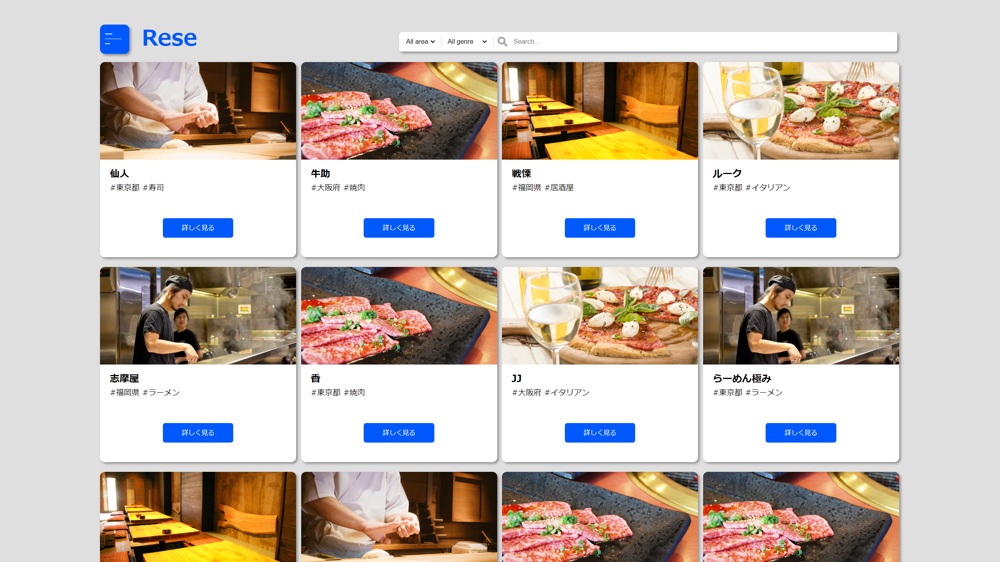
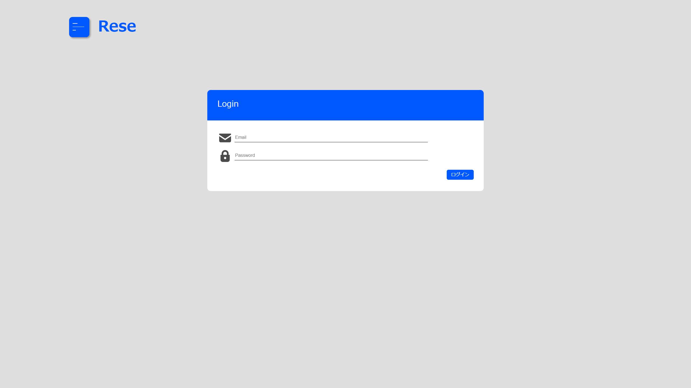
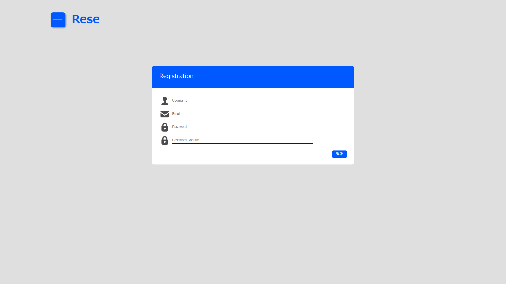
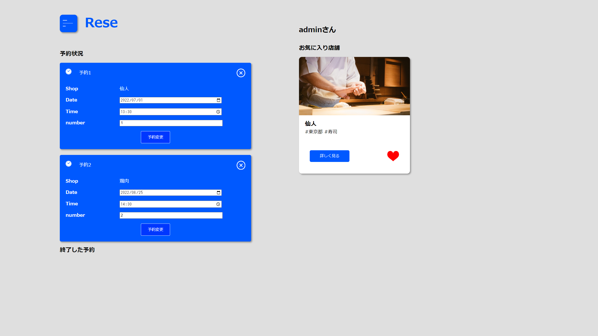
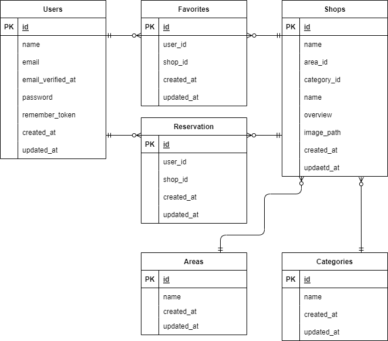

# Rese(飲食店予約サービス)

## 目次
| 番号 | 項目 |
|:-:|:--|
| 1 | [URL](https://github.com/takamasa0719/Rese#1url) |
| 2 | [概要](https://github.com/takamasa0719/Rese#2%E6%A6%82%E8%A6%81) |
| 3 | [制作背景](https://github.com/takamasa0719/Rese#3%E5%88%B6%E4%BD%9C%E8%83%8C%E6%99%AF) |
| 4 | [目的](https://github.com/takamasa0719/Rese#4%E7%9B%AE%E7%9A%84) |
| 5 | [使用画面のイメージ](https://github.com/takamasa0719/Rese#5%E4%BD%BF%E7%94%A8%E7%94%BB%E9%9D%A2%E3%81%AE%E3%82%A4%E3%83%A1%E3%83%BC%E3%82%B8) |
| 6 | [使用技術、バージョン](https://github.com/takamasa0719/Rese#6%E4%BD%BF%E7%94%A8%E6%8A%80%E8%A1%93%E3%83%90%E3%83%BC%E3%82%B8%E3%83%A7%E3%83%B3) |
| 7 | [環境構築手順](https://github.com/takamasa0719/Rese#7%E7%92%B0%E5%A2%83%E6%A7%8B%E7%AF%89%E6%89%8B%E9%A0%86) |
| 8 | [機能一覧](https://github.com/takamasa0719/Rese#8%E6%A9%9F%E8%83%BD%E4%B8%80%E8%A6%A7) |
| 9 | [工夫点](https://github.com/takamasa0719/Rese#9%E5%B7%A5%E5%A4%AB%E7%82%B9) |
| 10 | [苦労した点](https://github.com/takamasa0719/Rese#10%E8%8B%A6%E5%8A%B4%E3%81%97%E3%81%9F%E7%82%B9) |
| 11 | [DB設計](https://github.com/takamasa0719/Rese#11db%E8%A8%AD%E8%A8%88) |

## 1.URL

AWS: ec2-13-230-211-2.ap-northeast-1.compute.amazonaws.com
heroku: https://develop-rese-app.herokuapp.com/

## 2.概要
ある企業のグループ会社の飲食店予約サービス

## 3.制作背景
外部の飲食店予約サービスは手数料を取られるので自社で予約サービスを持ちたい。

## 4.目的
初年度でのユーザー数10,000人達成

## 5.使用画面のイメージ
トップページ
  

ログインページ
  

新規登録ページ
  

マイページ
  

店舗詳細ページ
  

## 6.使用技術、バージョン
- フロントエンド
    - HTML / CSS
    - javascript
- バックエンド
    - PHP 8.1.2
    - Laravel 8.83.13
- インフラ、その他
    - MySQL 15.1
    - Visual Studio Code
    - draw.io

## 7.環境構築手順

## 8.機能一覧
- ユーザー関連
    - ユーザー登録機能
    - ログイン機能
- 飲食店関連
    - 店舗一覧閲覧
    - 店舗詳細閲覧
    - 店舗検索
    - お気に入り
    - 店舗予約

## 9.工夫点

## 10.苦労した点

## 11.DB設計
### ER図
  

### テーブル設計
#### usersテーブル
ユーザーを管理する。
| カラム名           | 属性              | 役割                                                      |
|:------------------|:------------------|:---------------------------------------------------------|
| id                | unsigned bigint               | ユーザーを識別するID                                      |
| name              | varchar(255)             | ユーザー名                                                |
| email             | varchar(255)/unique | メールアドレス                                            |
| email_verified_at | timestamp         | -                                                        |
| password          | varchar(255)             | パスワード                                                |
| rememberToken     | varchar(100)             |-                                                           |
| created_at        | timestamp         | 作成日時                                                  |
| created_at        | timestamp         | 更新日時                                                  |
#### shopsテーブル
店舗を管理する。
| カラム名    | 属性           | 役割                      |
|:-----------|:---------------|:-------------------------|
| id         | unsigned bigint            | 店舗を識別するID          |
| area_id    | unsigned bigint            | 店舗のエリアID               |
| category_id| unsigned bigint            | 店舗のカテゴリーID          |
| name       | varchar(255)          | 店舗の名前                |
| overview   | text          | 店舗の詳細                |
| image_path | varchar(255)          | 店舗の画像URL             |
| created_at | timestamp      | 作成日時                  |
| updated_at | timestamp      | 更新日時                  |
#### areasテーブル
エリアを管理する。
| カラム名   | 属性       | 役割                          |
|:-----------|:----------|:-----------------------------|
| id         | unsigned bigint       | エリアを識別するID            |
| name       | varchar(255)     | エリア名                      |
| created_at | timestamp | 作成日時                      |
| updated_at | timestamp | 更新日時                      |
#### categoriesテーブル
カテゴリーを管理する。
| カラム名    | 属性              | 役割             |
|:-----------|:------------------|:----------------|
| id         | unsigned bigint               | カテゴリーを識別するID |
| name       | varchar(255)             | カテゴリー名          |
| created_at | timestamp         | 作成日時         |
| updated_at | timestamp         | 更新日時         |
#### favoritesテーブル
お気に入りを管理する。usersテーブルとshopsテーブルを紐付ける中間テーブル。
| カラム名    | 属性       | 役割                   |
|:-----------|:-----------|:-----------------------|
| id         | unsigned bigint       | お気に入りを識別するID |
| user_id    | unsigned bigint       | お気に入りしたユーザーのid |
| shops_id   | unsigned bigint       | お気に入りした店舗のid |
| created_at | timestamp | 作成日時                |
| updated_at | timestamp | 更新日時                |
#### reservationsテーブル
予約を管理する。usersテーブルとshopsテーブルを紐付ける中間テーブル。
| カラム名    | 属性       | 役割                   |
|:-----------|:-----------|:-----------------------|
| id         | unsigned bigint       | 予約を識別するID        |
| user_id    | unsigned bigint       | 予約したユーザーのid    |
| shops_id   | unsigned bigint       | 予約した店舗のid        |
| course_id  | unsigned bigint       | 予約したコースのid      |
| date       | date       | 予約の日付              |
| time       | time       | 予約の時刻              |
| number     | tinyint       | 予約の人数              |
| created_at | timestamp | 作成日時                |
| updated_at | timestamp | 更新日時                |
#### reviewsテーブル
評価を管理する。usersテーブルとshopsテーブルを紐付ける中間テーブル。
| カラム名    | 属性       | 役割                   |
|:-----------|:-----------|:-----------------------|
| id         | unsigned bigint       | 予約を識別するID        |
| user_id    | unsigned bigint       | 予約したユーザーのid    |
| shops_id   | unsigned bigint       | 予約した店舗のid        |
| rating      | tinyint            | 評価（★）              |
| review       | varchar(255)       | 評価内容             |
| created_at | timestamp | 作成日時                |
| updated_at | timestamp | 更新日時                |
#### coursesテーブル
コースを管理する。
| カラム名    | 属性       | 役割                   |
|:-----------|:-----------|:-----------------------|
| id         | unsigned bigint       | 予約を識別するID        |
| shops_id   | unsigned bigint       | 予約した店舗のid        |
| name      | varchar(255)            | コース名              |
| amount       | integer       | コースの値段             |
| created_at | timestamp | 作成日時                |
| updated_at | timestamp | 更新日時                |

##### [↑ページトップへ](https://github.com/takamasa0719/Rese)